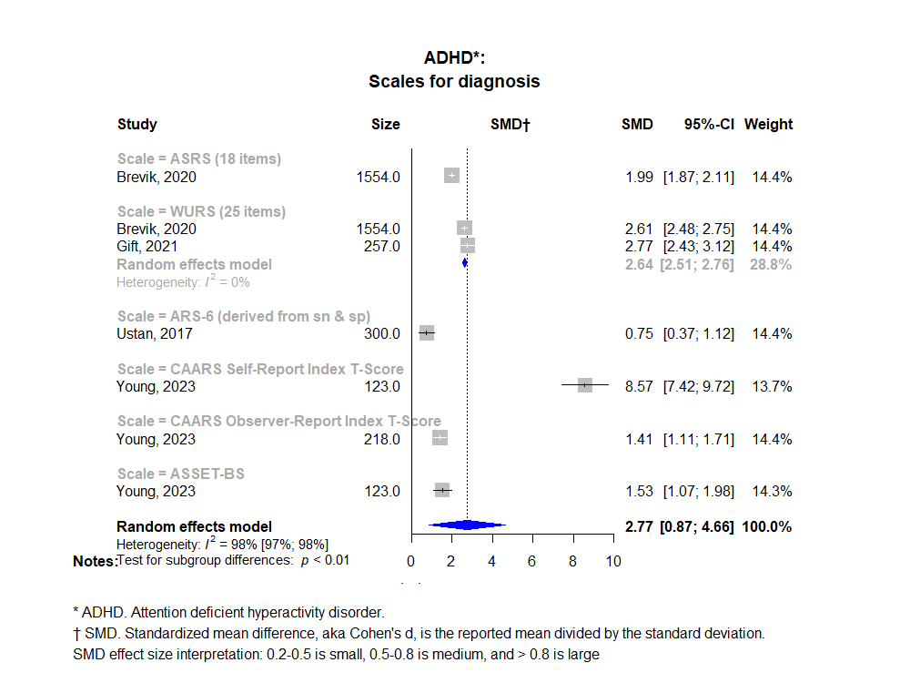

Adult AHDH: Diagnosis (under construction)
============================================
A living systematic review

Short url: https://openmetaanalysis.github.io/Adult-ADHD/

**Clinical summary:** This meta-analysis, based on limited data in a single studies for each scale, suggests that the Conners’ Adult ADHD Rating Scale (CAARS) Self-Report Index T-Score *is* the most accurate. Heterogeneity of results as measured by I2 was '[substantial](https://training.cochrane.org/handbook/current/chapter-10#section-10-10-2)' at 98% *across* scales, but cannot be measured for each scale as only a single study is available per scale. This review updates previously published meta-analysis(es).(citation[s] below). Taylor previously concluded using different studies with different metrics, "Conners’ Adult ADHD Rating scale and the Wender Utah Rating Scale (short version) hadmore robust psychometric statistics and content validity" ([Taylor, 2011](#systematic-reviews)).

<!-- Meta-regression of common modulators (year of publication, study size, event rate in the control groups) finds that the outcome of the intervention is effected by xx.-->

* [Reconciliation of studies and conclusions with prior meta-analyses](files/reconciliation-tables/Reconciliation%20of%20studies%20and%20conclusions.pdf)
* [Keep current with this topic](files/searching/Keep-up.md)

Acknowledgement: we acknowledge the essential work by the authors of the prior [systematic review(s)](#systematic-reviews) listed below.

**Methods overview:** This repository is an [openMetaAnalysis](https://openmetaanalysis.github.io/) that combines methods of scoping, rapid, and living systematic reviews.  This analysis updates one or more previously published review(s) below. A comparison of studies included in this review compared to prior reviews are in the table, [reconciliation of trials included with prior meta-analyses/](files/reconciliation-tables/Reconciliation%20of%20studies.pdf). Newer studies included are listed in the references below. Rationale for newer trials excluded may be listed at the end of the references. 
* [Methods](http://openmetaanalysis.github.io/methods.html) for openMetaAnalysis
* [Evidence search](files/searching/evidence-search.md) for this review (under construction)

**Results:** Details of the studies included are in the:
* [Reconciliation of studies and conclusions with prior meta-analyses](files/reconciliation-tables/Reconciliation%20of%20studies%20and%20conclusions.pdf) (under construction)
* [Description of studies (PICO table)](files/study-details/table-pico.pdf) (under construction)
* [Risk of bias assessment](files/study-details/table-bias.pdf) (under construction)
* [Forest plots](../master/files/forest-plots) ([spreadsheets with source data](files/data))
* [Network plots](../master/files/network) (optional)

The forest plot for the primary outcomes are below. Additional [forest plots](files/forest-plots) of secondary analyses may be available. 

<!--
The meta-regression for the primary outcomes are below. Additional [meta-regressions](files/metaregression) of secondary analyses may be available. 

-->
The GRADE Profile is below. 

References:
----------------------------------

### Systematic review(s)
#### Most recent review at time of last revision of this repository
1. Taylor A, Deb S, Unwin G. Scales for the identification of adults with attention deficit hyperactivity disorder (ADHD): a systematic review. Res Dev Disabil. 2011 May-Jun;32(3):924-38. doi: [10.1016/j.ridd.2010.12.036](http://doi.org/10.1016/j.ridd.2010.12.036). Epub 2011 Feb 12. PMID: [21316190](http://pubmed.gov/21316190).

### Original studies
#### New Studies *not* included in the most recent review above
None

#### Studies included in the review above
1. Brevik EJ, Lundervold AJ, Haavik J, Posserud MB. Validity and accuracy of the Adult Attention-Deficit/Hyperactivity Disorder (ADHD) Self-Report Scale (ASRS) and the Wender Utah Rating Scale (WURS) symptom checklists in discriminating between adults with and without ADHD. Brain Behav. 2020 Jun;10(6):e01605. doi: [10.1002/brb3.1605](http://doi.org/10.1002/brb3.1605). Epub 2020 Apr 13. Erratum in: Brain Behav. 2021 May;11(5):e02067. PMID: [32285644](http://pubmed.gov/32285644).
2. Gift TE, Reimherr ML, Marchant BK, Steans TA, Reimherr FW. Wender Utah Rating Scale: Psychometrics, clinical utility and implications regarding the elements of ADHD. J Psychiatr Res. 2021 Mar;135:181-188. doi: 10.1016/j.jpsychires.2021.01.013. Epub 2021 Jan 14. PMID: [33493947](http://pubmed.gov/33493947).
3. Ustun B, Adler LA, Rudin C, Faraone SV, Spencer TJ, Berglund P, Gruber MJ, Kessler RC. The World Health Organization Adult Attention-Deficit/Hyperactivity Disorder Self-Report Screening Scale for DSM-5. JAMA Psychiatry. 2017 May 1;74(5):520-527. doi: 10.1001/jamapsychiatry.2017.0298. Erratum in: JAMA Psychiatry. 2017 Dec 1;74(12):1279. Erratum in: JAMA Psychiatry. 2019 Nov 1;76(11):1213. PMID: [28384801](http://pubmed.gov/28384801).
4. Young JL, Powell RN, Zabel C, Saal J, Welling LLM, Fortain J, Ceresnie A. Development and validation of the ADHD Symptom and Side Effect Tracking - Baseline Scale (ASSET-BS): a novel short screening measure for ADHD in clinical populations. BMC Psychiatry. 2023 Nov 6;23(1):806. doi: 10.1186/s12888-023-05295-6. PMID: [37932675](http://pubmed.gov/37932675).

#### Studies undergoing review
Studies reviewed by Taylor, 2011 (Table 2 of Taylor) that reported different metrics:

CAARS:
1. Conners, Erhadt, Epstein, et al. (1999)
2. Cleland, Magura, Foote, Rosenblum, and Kosanke (2006)
3. Erhardt et al. (1999)
4. Belenduik et al. Assessing the concordance of measures used to diagnose adult ADHD. Journal of Attention Disorders. 2007:10;276–287.
5. Solanto et al. (2004)
6. Kooij et al. (2008)
7. Adler et al. The reliability and validity of self- and investigator ratings of ADHD in adults. Journal of Attention Disorders. 2008:11;711.
8. 
ASRS:
1. Kessler et al. (2005)
2. Reuter et al. (2006)
3. Adler et al. (2006)
4. Kessler et al. (2007)

#### Studies excluded - selected list of important studies
None

#### Cited by
This repository is cited by:

1. WikiDoc contributors. Pending content page. WikiDoc. Nov 9, 2014. Available at: http://www.wikidoc.org/index.php/This_topic. Accessed November 9, 2014. 

-------------------------------
[Cite and use this content](https://github.com/openMetaAnalysis/openMetaAnalysis.github.io/blob/master/reusing.MD)  - [Edit this page](../../edit/master/README.md) - [License](files/LICENSE.md) - [History](../../commits/master/README.md)  - 
[Issues and comments](../../issues?q=is%3Aboth+is%3Aissue)

